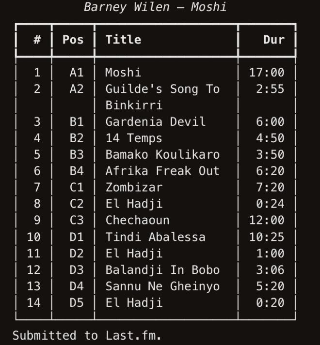
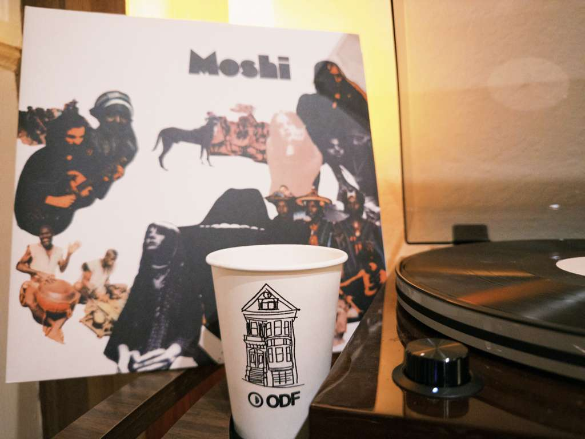

# scrobble-cli

An open-source (MIT) CLI for scrobbling vinyl records from your terminal (I originally built it because I wanted to do this while already in Claude Code).

It:

- Looks up an album on Discogs (tracklist + durations)
- Lets you pick the correct release in a TUI (unless it's extremely confident)
- Scrobbles the whole album to Last.fm in one go

## Features

- Album scrobbling designed for vinyl (Discogs-first tracklists)
- Interactive release picker (TUI)
- Timestamp modes:
  - "started now" (default): you're putting it on right as you run the command
  - "ended now": prefix the query with `ended`
- `--dry-run` to preview without sending anything
- `--allow-ignored` if Last.fm ignores some tracks (e.g. very short interludes)

## Screenshots

| | |
|---|---|
|  |  |

## Install

Requires Python 3.10+.

### From source (recommended while this is young)

```bash
python -m venv .venv
source .venv/bin/activate
python -m pip install -U pip
python -m pip install -e .
```

## Setup (local only)

Secrets are stored in your user config directory (not in this repo) with permissions set to `0600`.
Run `scrobble status` to see the exact path on your OS.

You can either:
- run the interactive auth commands below, or
- set env vars (`DISCOGS_TOKEN`, `LASTFM_API_KEY`, `LASTFM_API_SECRET`) for the current shell.

### Discogs

Create a Discogs personal access token (Discogs settings → Developers: https://www.discogs.com/settings/developers), then:

```bash
scrobble auth discogs
```

### Last.fm

Last.fm requires an API key + secret (annoying, but required to sign requests). Create one (Last.fm API account page: https://www.last.fm/api/account/create), then:

```bash
scrobble auth lastfm
```

This opens a browser to authorize and stores a Last.fm session key locally (no Last.fm password).

## Usage

### Scrobble when you start listening (default)

```bash
scrobble album barney wilen moshi
```

### Scrobble when you just finished listening

```bash
scrobble album ended barney wilen moshi
```

### Override timestamps

```bash
scrobble album miles davis kind of blue --started-at "2026-01-31T19:32:00"
scrobble album ended miles davis kind of blue --ended-at "2026-01-31T20:18:00"
```

### Preview without scrobbling

```bash
scrobble album miles davis kind of blue --dry-run
```

### If Last.fm ignores short tracks

```bash
scrobble album barney wilen moshi --allow-ignored
```

### Debug config (masked)

```bash
scrobble status
```

## Claude Code skill

scrobble-cli was built to be used from [Claude Code](https://claude.com/claude-code). The `/scrobble` skill lets you scrobble vinyl without leaving your session.

### Setup

1. Clone and install (see [Install](#install) above)

2. Copy the skill file into your global Claude Code commands:

```bash
cp claude-code/scrobble.md ~/.claude/commands/scrobble.md
```

3. Replace `SCROBBLE_CLI_PATH` in the copied file with the absolute path to your clone:

```bash
# macOS / Linux
sed -i'' -e "s|SCROBBLE_CLI_PATH|$(pwd)|g" ~/.claude/commands/scrobble.md
```

4. Add a Bash permission so the wrapper runs without prompting. Add this to `~/.claude/settings.local.json` under `permissions.allow`:

```json
"Bash(/absolute/path/to/scrobble-cli/scrobble-wrapper.sh:*)"
```

5. Set up auth (one-time, in your regular terminal):

```bash
source .venv/bin/activate
scrobble auth discogs
scrobble auth lastfm
```

### Usage in Claude Code

```
/scrobble miles davis kind of blue
/scrobble ended barney wilen moshi
/scrobble coltrane a love supreme --dry-run
```

The skill searches Discogs, shows you the results, and scrobbles once you pick a release.

## Publishing / safety checklist (don't leak tokens)

- Never paste tokens into `README.md`, issues, or commit messages.
- Confirm you're not committing local workspace artifacts: `.context/` is ignored via `.gitignore`.
- Double-check before pushing:
  - `git status` shows no secrets added
  - `rg -n "LASTFM_|DISCOGS_|api_key|api_secret|session_key|token=" -S .`

## License

MIT. See `LICENSE`.
